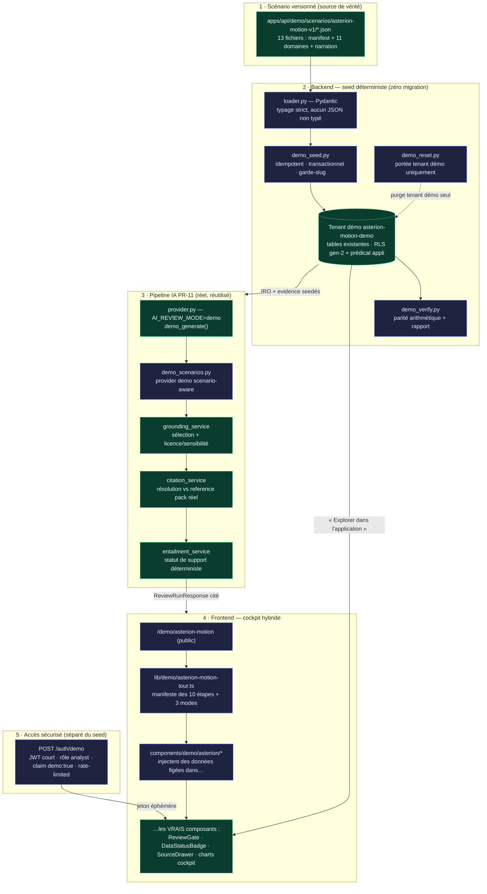

# DEMO_ARCHITECTURE — Démonstration produit « Asterion Motion »

> **100 % FICTIF · IA SIMULÉE · ZÉRO APPEL EXTERNE.** Ce document décrit l'architecture
> technique de la démonstration `asterion-motion-v1`. La source de vérité du **scénario**
> reste [`ASTERION_SCENARIO.md`](./ASTERION_SCENARIO.md) ; ce document ne la contredit pas,
> il explique **comment** elle est mise en œuvre. Version : `asterion-motion-v1`.

## 1. Intention et thèse produit

La démonstration déroule la chaîne de valeur complète de CarbonCo Intelligence sur un cas
industriel fictif mais cohérent — **Asterion Motion SAS**, équipementier de moteurs
électriques E-Drive X4, 12 000 moteurs/an — de l'import des achats jusqu'à l'Evidence Pack,
en passant par Scope 3, CRMA, Scope 2, eau/nature, la double matérialité (IRO) et
**l'assistant IA cité sous revue humaine** (pipeline PR-11, mode `demo` déterministe).

Thèse prouvée par l'architecture elle-même : *l'IA assiste et cite, l'humain décide ; tout
chiffre a une source, un statut et une méthode ; estimé ≠ vérifié ; risque ≠ confiance.*

La démonstration est **déterministe** (aucun aléa), **à coût nul** (aucun modèle payant),
**hors-ligne** (aucun réseau externe) et **cloisonnée** (tenant démo `asterion-motion-demo`,
RLS). Elle réutilise le vrai code produit ; elle ne crée pas un « faux » parallèle.

## 2. Vue d'ensemble — flux de données

Légende : **vert** = existant/réutilisé (les 13 JSON, le pipeline PR-11, les composants
cockpit, les tables) · **bleu** = construit pour la démonstration (loader, scripts de seed,
provider scenario-aware, endpoint d'accès, cockpit et manifeste de tour).

## 3. Backend — scénario → loader → seed → verify

### 3.1 Scénario versionné

Toutes les valeurs canoniques vivent dans `apps/api/demo/scenarios/asterion-motion-v1/`
(**13 fichiers JSON**) : `manifest.json` (chiffres attendus + statuts IA attendus),
`company`, `suppliers`, `products-and-bom`, `purchases`, `energy`, `water`, `nature`,
`crma`, `iro`, `evidence`, `ai-review`, `narration`. Le versionnement est explicite
(`asterion-motion-v1`) : un futur `v2` ne casse pas `v1`.

### 3.2 Loader typé (Pydantic — aucun JSON non typé)

`apps/api/demo/loader.py` charge et **valide** chaque fichier via des modèles Pydantic. Toute
dérive de schéma échoue au chargement, pas au runtime. Conforme à la règle projet « No
untyped JSON » : le seed ne manipule jamais de dictionnaire brut.

### 3.3 Seed idempotent, transactionnel, gardé

`apps/api/scripts/demo_seed.py` :

- **N'utilise que des tables et services existants** — **zéro migration SQL** (voir §7).
- Écrit exclusivement dans le **tenant démo** (`company` de slug `asterion-motion-demo`) ;
  **refuse de s'exécuter si le slug ne correspond pas** (garde-slug). Ne touche jamais de
  donnée réelle.
- **Idempotent** : ré-exécuter le seed converge vers le même état (upsert par clés
  logiques), il ne duplique pas.
- **Transactionnel** et **dry-run** disponible : prévisualisation sans écriture.
- Marque chaque enregistrement `synthetic=true` et lui attache **source + date + statut +
  méthode**.

Ce que le seed insère concrètement (cf. `evidence.json`, `iro.json`) :

- des **observations** de l'Evidence Kernel — typées, sourcées, porteuses de statut
  (`obs-dependency` 92 % `estimated`, `obs-recycled-proven` 35 % `verified`,
  `obs-recycled-declared` 80 % `manual`, plus les lignes d'achats, énergie, eau…) ;
- l'**échafaudage IRO/evidence réel** : l'IRO candidate « Dépendance critique aux aimants
  terres rares (E-Drive X4) » (exposition financière indicative 1,4 M€, `estimated`), ses
  artefacts (`artifact-dependency-study`, `artifact-recycled-audit`), ses sources et
  releases, et les artefacts **exclus** pour licence/sensibilité (grille tarifaire
  `confidential`, benchmark `license_blocked`) qui alimentent la trace de filtrage.

### 3.4 Vérification par parité arithmétique

`apps/api/scripts/demo_verify.py` **recalcule et compare**, produisant un **rapport de
parité**. Il vérifie l'**arithmétique** attendue plutôt que de rétro-ingénier chaque moteur
de calcul :

- somme des lignes Scope 3 achats = **3 480 tCO2e** ;
- part des aimants = **61,8 %** ;
- couverture contractuelle Scope 2 = **54 %** (cohérente avec MB 1 090 < LB 1 860) ;
- prélèvement eau = **72 000 m³**, dépendance terres rares lourdes = **92 %** (`estimated`).

`verify` **refuse de s'exécuter en cas de slug non conforme** et signale toute dérive.

### 3.5 Reset borné au tenant démo

`apps/api/scripts/demo_reset.py` purge **uniquement** le tenant `asterion-motion-demo`
(garde-slug identique au seed) puis, optionnellement, re-seed. Il **ne supprime jamais** de
donnée réelle. C'est le mécanisme du bouton/raccourci « reset » de la démonstration.

### 3.6 Workflow GitHub manuel et protégé

`.github/workflows/demo-scenario.yml` expose trois actions **manuelles**
(`workflow_dispatch`) : `verify`, `seed`, `reset`. **Aucune écriture automatique au
déploiement** : un déploiement Vercel ne seed ni ne reset jamais. Le seed est un geste
opérateur explicite et tracé.

## 4. Pipeline IA (PR-11 réel, réutilisé) et déterminisme des 4 statuts

La revue IA de la démonstration **n'est pas une maquette** : elle passe par le vrai pipeline
PR-11. Le `provider.py` existant expose déjà `AI_REVIEW_MODE=demo` (défaut) avec
`demo_generate()` — réponse **déterministe** construite à partir du reference pack, empreinte
de prompt reproductible, **aucun coût, aucun réseau**. Le mode `live` n'est **jamais** activé.

Ce qui est ajouté : `apps/api/services/intelligence/ai/demo_scenarios.py`, un provider demo
**scenario-aware** branché dans `provider.py`. Il reconnaît les sujets Asterion (IRO « aimants
terres rares », enveloppe de calcul `scope2:`) et produit les **brouillons de claims** du
scénario. Le reste du pipeline reste **inchangé et réel** :

1. **Sélection des preuves** (`grounding_service`) — reference pack minimisé, sous RLS du
   tenant démo.
2. **Licence & sensibilité** (`grounding_service`) — exclusion des artefacts non
   affichables/sensibles (grille tarifaire `confidential` → motif *sensitivity* ; benchmark
   `license_blocked` → motif *licence*).
3. **Résolution des citations** (`citation_service`) — chaque citation est résolue **contre
   le reference pack réel** par `match_marker` ; **jamais d'ID codé en dur**.
4. **Confrontation claims ↔ preuves** (`entailment_service`) — le **statut de support est
   calculé déterministiquement**, jamais déclaré par le provider.
5. **Génération du brouillon** — labels de gouvernance `DRAFT` / `SUGGESTION` /
   `REVIEW_REQUIRED`.
6. **Attente de revue humaine** — accept / reject / modify + justification.

### 4.1 Comment les 4 statuts émergent (déterministe)

Le seed prépare l'évidence pour que **chaque statut émerge naturellement** du calcul, pas
d'une déclaration. Trois statuts viennent de **UC-1 (revue de l'IRO)** ; le quatrième vient
de **UC-2 (explication de calcul Scope 2)** :

| # | Claim (brouillon IA) | Voie | Statut | Mécanisme déterministe |
|---|---|---|---|---|
| 1 | « Les aimants représentent **61,8 %** des émissions Scope 3 achats. » | **UC-2** | **`supported`** | Corroboration par **résultat de calcul déterministe** (`calc_result`) : citations résolues, exactes et fraîches. Le provider demo n'atteint `supported` **que** par une explication de calcul. |
| 2 | « La dépendance aux terres rares lourdes dépasse **90 %**. » | UC-1 | **`partially_supported`** | Cite une observation **`estimated`** (92 %, `artifact-dependency-study`) : résolue mais non corroborée déterministiquement → au mieux partiel. |
| 3 | « Le contenu recyclé déclaré des aimants est de **80 %**. » | UC-1 | **`contradicted`** | La preuve citée (audit masse-bilan tiers, `artifact-recycled-audit`) **prouve 35 %** (`verified`) → écart chiffré → contradiction détectée. |
| 4 | « Un fournisseur alternatif est qualifiable **sous 90 jours**. » | UC-1 | **`unsupported`** | **Aucune** référence interne ne l'étaye (pas de marqueur de citation) → non étayé. |

> **Point d'honnêteté clé.** La revue IA sur l'IRO seedé (**UC-1**) est **entièrement réelle**
> (sélection, licence, résolution, entailment, gate). Le statut **`supported`** n'est
> atteignable qu'en **UC-2**, où un claim cite le `calc_result` déterministe Scope 2 : c'est
> la seule voie par laquelle une corroboration exacte et fraîche produit `supported`. Le cas
> vitrine « aimants 61,8 % » est donc démontré via cette voie de corroboration de calcul, pas
> via une simple observation.

En complément, l'assistant émet des **questions de revue** et des **suggestions d'action**
(« diversifier la source d'aimants », « documenter la méthode du taux recyclé »), toutes
`SUGGESTION`, jamais promues sans geste humain. Le passage par la **gate de revue** est
obligatoire avant tout effet métier : **l'IA ne décide jamais**.

### 4.2 Trace fonctionnelle — jamais de chain-of-thought

L'UI n'affiche que les **6 étapes fonctionnelles** ci-dessus (`select`, `license`, `resolve`,
`entail`, `draft`, `review`). Le **raisonnement interne du modèle** — « pensée », tokens de
raisonnement — est **interdit d'affichage**. Ce que le spectateur voit est le *pipeline*, pas
une confabulation.

## 5. Accès sécurisé — `POST /auth/demo` (séparé du seed)

L'ancien mot de passe démo codé en dur est **remplacé**. `POST /auth/demo` est un endpoint
**sans jeton** qui **frappe une clé courte** :

- émet un **JWT court** pour le tenant démo fixe, rôle **`analyst`**, avec un claim
  **`demo: true`** ;
- **aucun refresh cookie** → **auto-expiration** ; aucune session longue ;
- **aucun secret client** n'est livré au frontend ;
- **rate-limited** ; **aucune permission globale**, **aucune IA live**, **aucun upload
  externe**.

**Séparation nette** : `/auth/demo` **ne seed pas**. Il garantit seulement que l'entreprise
et l'utilisateur démo existent et **émet un jeton**. Le peuplement des données est le rôle,
distinct, de `demo_seed.py` / du workflow. Le cockpit figé fonctionne sans jeton (voir §6) ;
le jeton ne sert qu'à l'**exploration dans la vraie application**.

## 6. Frontend — cockpit hybride (données figées dans les vrais composants)

Le cockpit public vit à **`/demo/asterion-motion`** dans `apps/carbon`. Il **ne remplace pas**
la route cinématique existante `/demo` (`app/demo/page.tsx`, `layout.tsx`,
`verify/[hash]/page.tsx`) : c'est une **route sœur** distincte.

Principe **hybride** : les composants sous `components/demo/asterion/*` **injectent des
données Asterion figées** (dérivées du scénario) dans les **vrais composants existants** du
produit — `ReviewGate`, `DataStatusBadge`, `SourceDrawer`, les charts du cockpit. Le
spectateur voit donc **l'interface réelle**, pas une capture d'écran. Le manifeste de tour
`lib/demo/asterion-motion-tour.ts` porte les **10 étapes**, les **3 modes** et les liens
« Explorer dans l'application ».

**10 étapes** (chacune avec « Explorer dans l'application ») :

| # | Étape | Focus | « Explorer » |
|---|---|---|---|
| 1 | Situation | 12 000 moteurs/an | `/dashboard` |
| 2 | Import des achats | 5,8 M€ | `/fournisseurs/scope3` |
| 3 | Scope 3 — hotspots | part aimants 61,8 % | `/scopes` |
| 4 | CRMA — matières critiques | dépendance 92 % (`estimated`) | `/crma` |
| 5 | Scope 2 — double reporting | MB 1 090 / LB 1 860, couv. 54 % | `/scopes` |
| 6 | Eau & nature | 72 000 m³, stress élevé (conf. 0,81) | `/water` |
| 7 | IRO — double matérialité | exposition 1,4 M€ | `/iro` |
| 8 | Revue IA citée | les 4 cas, trace fonctionnelle | `/iro` |
| 9 | Décision humaine | accept / reject / modify | `/iro` |
| 10 | Evidence Pack | sources + statuts + méthodes | `/intelligence/sources` |

**3 modes** : `guided` (pas-à-pas), `director` (auto, ~2 min), `explore` (libre).

**Trace IA affichée** : uniquement les étapes fonctionnelles (sélection de preuves,
licence/sensibilité, résolution de citations, confrontation claim↔preuve, génération du
brouillon, attente de revue) — **jamais** de chaîne de raisonnement.

**Animations** (respectant `prefers-reduced-motion`) : crossfade 180–240 ms, spotlight,
count-up, auto-scroll interruptible, tiroir d'évidence, barre de progression, morphing
hotspot → IRO.

**Badges permanents à l'écran** : **IA SIMULÉE · ZÉRO APPEL EXTERNE · DÉMONSTRATION
FICTIVE**.

## 7. Rationale « zéro migration »

La démonstration **n'ajoute aucune migration SQL**. Justification :

- Le scénario n'introduit **aucun concept de données nouveau** : achats, observations,
  IRO, artefacts, sources, releases, décisions de revue **existent déjà** dans le schéma.
- Le seed passe par les **services existants** et écrit dans les **tables existantes**,
  simplement **scopé au tenant démo**. Une donnée de démonstration est, structurellement,
  une donnée comme une autre — seulement `synthetic=true` et cloisonnée.
- Zéro migration = **zéro risque** pour le schéma de production, **zéro dette**, et un
  reset trivialement borné (supprimer les lignes du tenant démo).

## 8. Invariants de sécurité et de gouvernance

- **L'IA est consultative** : elle cite et propose, **l'humain décide** (gate de revue
  obligatoire avant tout effet métier).
- **Chaque valeur porte source + date + statut + méthode**. **Estimé ≠ vérifié**
  (92 % dépendance est `estimated`, jamais présenté comme prouvé). **Risque ≠ confiance**
  (stress hydrique élevé ET confiance 0,81 sont deux axes distincts).
- **Isolation par tenant (RLS)** : gen-2 + prédicat applicatif ; le grounding sélectionne
  sous RLS du tenant démo.
- **Citations résolues contre le reference pack réel**, jamais d'ID inventé.
- **Reset borné au tenant démo** (garde-slug) ; aucune donnée réelle touchée.
- **Aucun modèle payant, aucun réseau, aucune activation live** ; `AI_REVIEW_MODE=demo`.

## 9. Inventaire des fichiers

**Existant / réutilisé**

- `apps/api/demo/scenarios/asterion-motion-v1/*.json` — 13 fichiers (source de vérité).
- `apps/api/services/intelligence/ai/` — pipeline PR-11 réel : `provider.py` (mode `demo`),
  `grounding_service.py`, `citation_service.py`, `entailment_service.py`,
  `review_service.py`, `review_decision_service.py`.
- `apps/carbon/app/demo/` — route **cinématique existante** (à **ne pas** modifier).

**Construit pour la démonstration**

- Backend : `apps/api/demo/loader.py` (Pydantic) · `apps/api/scripts/demo_seed.py`,
  `demo_reset.py`, `demo_verify.py` · `apps/api/services/intelligence/ai/demo_scenarios.py`
  (provider demo scenario-aware) · endpoint `POST /auth/demo` ·
  `.github/workflows/demo-scenario.yml` (verify/seed/reset manuels).
- Frontend : `apps/carbon/app/demo/asterion-motion/` (route/page) ·
  `apps/carbon/components/demo/asterion/*` · `apps/carbon/lib/demo/asterion-motion-tour.ts`.
- Docs : `docs/carbonco/demo/` (ce dossier).

## 10. Note d'honnêteté — CI et absence de Postgres local

Comme pour l'ensemble du chantier CarbonCo, **il n'y a pas de PostgreSQL local dans cet
environnement**. Par conséquent :

- Les comportements **dépendants de la base** — idempotence du seed, garde-slug, portée
  tenant du reset, parité de `demo_verify` — sont **prouvés en CI uniquement** (base de test
  éphémère du pipeline), **jamais** exécutés localement ici.
- `demo_verify` contrôle la **parité arithmétique** (sommes de lignes = 3 480, part aimants
  61,8 %, couverture 54 %) — il **ne rétro-ingénie pas** chaque moteur de calcul.
- La **revue IA sur l'IRO seedé (UC-1)** est **entièrement réelle** ; le statut `supported`
  requiert la **voie UC-2** (explication de calcul Scope 2 citant un `calc_result`).
- Le **cockpit figé** (`/demo/asterion-motion`) est autonome : il rend des données Asterion
  figées dans les vrais composants et **fonctionne hors-ligne sans base ni seed**. Le seed
  n'est nécessaire que pour l'**exploration dans la vraie application** (liens « Explorer »).

*Fin de DEMO_ARCHITECTURE.md — architecture de la démonstration `asterion-motion-v1`.*
